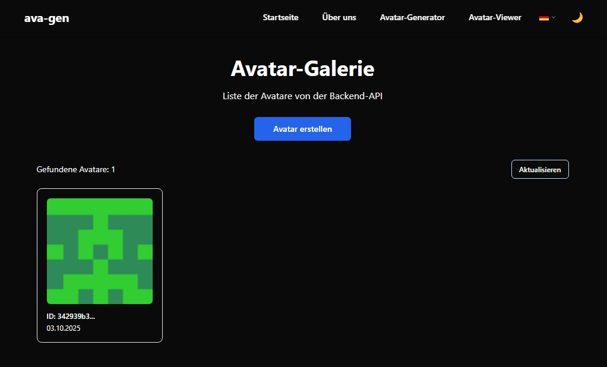
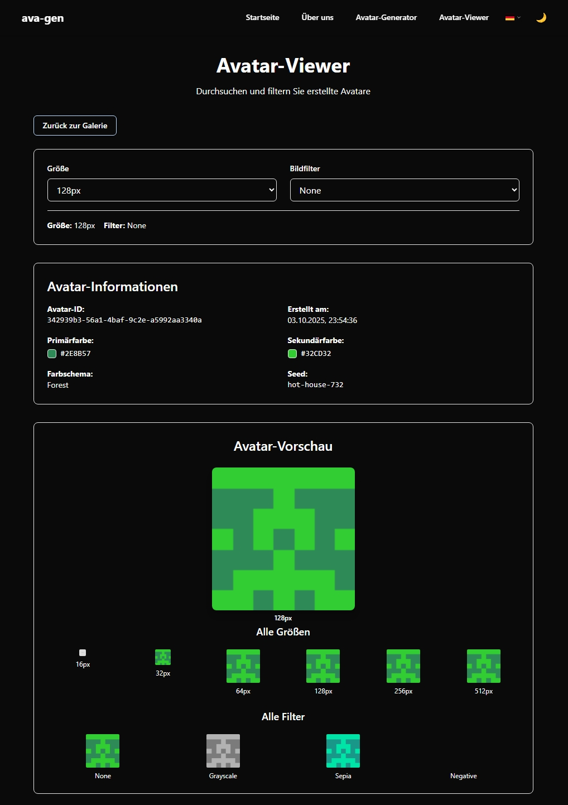

# 🎨 Avatar Generator

[](https://opensource.org/licenses/MIT)
[](CONTRIBUTING.md)
[](https://github.com/letnull19A/avatar-gen/actions)

> Генератор аватаров в стиле GitHub/GitLab с открытым исходным кодом

## 🚀 Быстрый старт

```bash
# Запуск с Docker
git clone https://github.com/letnull19A/avatar-gen.git
cd avatar-gen
./scripts/start.sh --db sqlite --storage local

# Открыть в браузере
open https://localhost:12745
```

## ✨ Основные возможности

- **🎯 Генерация аватаров** - создание уникальных изображений на основе
  параметров
- **🎨 Цветовые схемы** - встроенные палитры (pastel, vibrant, monochrome)
- **📏 Множественные размеры** - от 32x32 до 512x512 пикселей
- **🔍 Фильтры изображений** - градация серого, сепия, негатив
- **💾 Гибкое хранение** - локальное или S3-совместимое хранилище
- **🗄️ База данных** - SQLite (dev) или PostgreSQL (prod)
- **🔒 SSL/TLS** - безопасное соединение через Gateway
- **📚 API** - REST API с Swagger документацией
- **🐳 Docker** - полная контейнеризация

## 📸 Скриншоты

### Avatar-Galerie - Галерея аватаров



_Главная страница с галереей сгенерированных аватаров_

### Avatar-Viewer - Просмотр и фильтрация



_Страница для детального просмотра аватаров с фильтрами и размерами_

## 🎯 Выберите свой путь

<table>
<tr>
<td width="33%">

### 👤 Пользователи

**Хотите использовать Avatar Generator?**

→ [Модуль для пользователей](docs/modules/01-users/)

- Быстрый старт
- Установка и настройка
- Примеры использования
- Решение проблем

</td>
<td width="33%">

### 🛠️ Разработчики

**Хотите модифицировать проект?**

→ [Модуль для разработчиков](docs/modules/02-developers/)

- Настройка разработки
- Архитектура проекта
- Backend и Frontend
- Добавление функций

</td>
<td width="33%">

### 🤝 Контрибьюторы

**Хотите внести вклад?**

→ [Модуль для контрибьюторов](docs/modules/03-contributors/)

- Процесс контрибуции
- Стандарты кода
- Pull Requests
- Сообщество

</td>
</tr>
</table>

## 🏗️ Архитектура

```
┌─────────────────────────────────────────────────┐
│           Gateway (Nginx SSL/TLS)               │
│           Port: 80 (HTTP), 12745 (HTTPS)        │
├─────────────────────────────────────────────────┤
│                                                 │
│  ┌──────────────┐  ┌──────────────┐  ┌───────┐│
│  │   Frontend   │  │   Backend    │  │Postgre││
│  │   (React)    │◄─┤   (NestJS)   │◄─┤  SQL  ││
│  │   :8080      │  │    :3000     │  │ :5432 ││
│  └──────────────┘  └──────────────┘  └───────┘│
│         ▲                  ▲              ▲    │
│         │                  │              │    │
│  ┌──────────────┐  ┌──────────────┐  ┌───────┐│
│  │ Static Files │  │   Storage    │  │  Data ││
│  │   (React)    │  │ Local/S3     │  │(Volume││
│  └──────────────┘  └──────────────┘  └───────┘│
└─────────────────────────────────────────────────┘
```

## 🛠️ Технологический стек

### Backend

- **NestJS 11** - фреймворк для Node.js
- **TypeScript 5.9** - типизированный JavaScript
- **TypeORM** - ORM для работы с БД
- **Prisma** - современная ORM
- **Sharp** - обработка изображений
- **Pino** - логирование

### Frontend

- **React 18** - UI библиотека
- **TypeScript 5.9** - типизированный JavaScript
- **Vite 6** - сборщик и dev сервер
- **Tailwind CSS** - CSS фреймворк
- **Redux Toolkit** - управление состоянием

### DevOps

- **Docker** - контейнеризация
- **Docker Compose** - оркестрация контейнеров
- **Nginx** - веб-сервер и reverse proxy
- **PostgreSQL 17** - production база данных
- **SQLite** - development база данных

## 📖 API Endpoints

| Метод    | Endpoint             | Описание                 |
| -------- | -------------------- | ------------------------ |
| `POST`   | `/api/generate`      | Создать новый аватар     |
| `GET`    | `/api/list`          | Получить список аватаров |
| `GET`    | `/api/{id}`          | Получить аватар по ID    |
| `DELETE` | `/api/{id}`          | Удалить аватар           |
| `GET`    | `/api/color-schemes` | Получить цветовые схемы  |
| `GET`    | `/api/health`        | Проверка состояния       |

### Примеры использования

#### Создание аватара

```bash
curl -X POST https://localhost:12745/api/generate \
  -H "Content-Type: application/json" \
  -k \
  -d '{
    "seed": "john_doe",
    "colorScheme": "vibrant"
  }'
```

#### Получение аватара

```bash
curl https://localhost:12745/api/{id}?size=7&filter=sepia -k -o avatar.png
```

## 🎨 Цветовые схемы

| Название     | Описание                | Основной цвет | Дополнительный цвет |
| ------------ | ----------------------- | ------------- | ------------------- |
| `pastel`     | Мягкие пастельные цвета | #FFB3BA       | #BAFFC9             |
| `vibrant`    | Яркие контрастные цвета | #FF6B6B       | #4ECDC4             |
| `monochrome` | Черно-белая схема       | #2C3E50       | #ECF0F1             |

## 📊 Размеры изображений

| Параметр | Размер  | Описание               |
| -------- | ------- | ---------------------- |
| `size=5` | 32x32   | Маленький              |
| `size=6` | 64x64   | Средний (по умолчанию) |
| `size=7` | 128x128 | Большой                |
| `size=8` | 256x256 | Очень большой          |
| `size=9` | 512x512 | Максимальный           |

## 🔍 Фильтры

- **`grayscale`** - оттенки серого
- **`sepia`** - сепия эффект
- **`negative`** - негатив

## 🐳 Docker

### Быстрый запуск

```bash
# SQLite (по умолчанию)
docker compose -f docker/docker-compose.yml up -d

# PostgreSQL
docker compose -f docker/docker-compose.yml --profile postgresql up -d

# Development режим
docker compose -f docker/docker-compose.dev.yml --profile i-am-fullstack up -d
```

### Доступ к приложению

- **HTTPS (рекомендуется):** https://localhost:12745
- **API:** https://localhost:12745/api
- **Swagger:** https://localhost:12745/swagger

## 🛠️ Разработка

### Установка

```bash
# Установка зависимостей
pnpm install

# Запуск в dev режиме
pnpm run dev

# Тестирование
pnpm run test
```

### Полезные команды

```bash
pnpm run dev          # Запуск в dev режиме
pnpm run build        # Сборка проекта
pnpm run test         # Запуск тестов
pnpm run lint         # Линтинг кода
pnpm run format       # Форматирование кода
```

## 📚 Документация

- **[Getting Started](docs/getting-started/README.md)** - быстрый старт
- **[API Reference](docs/api/README.md)** - справочник по API
- **[Docker Guide](docs/deployment/README.md)** - работа с Docker
- **[Contributing Guide](docs/contributing/README.md)** - вклад в проект

## 🤝 Вклад в проект

1. Форкните репозиторий
2. Создайте ветку для новой функции (`git checkout -b feature/amazing-feature`)
3. Зафиксируйте изменения (`git commit -m 'Add amazing feature'`)
4. Отправьте в ветку (`git push origin feature/amazing-feature`)
5. Откройте Pull Request

## 🆘 Получение помощи

- **GitHub Issues** - сообщения об ошибках и предложения
- **GitHub Discussions** - общие вопросы и обсуждения
- **Documentation** - подробная документация в модулях

## 📄 Лицензия

Этот проект распространяется под лицензией MIT. См. файл [LICENSE](LICENSE) для
подробностей.

---

**Создано с ❤️ для генерации уникальных аватаров**

**Версия:** 3.1  
**Последнее обновление:** 2025-01-15
