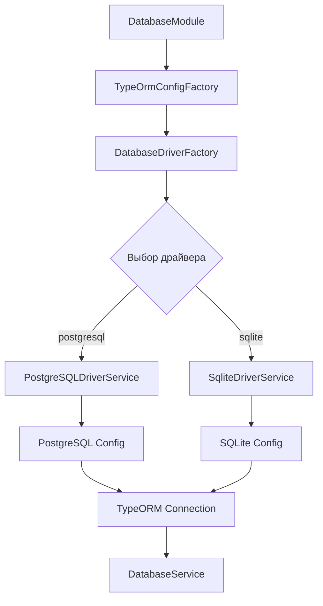

# Database Module - Architecture

## Архитектура v3.1.0 (Текущая)

### Структура модуля

```
src/modules/database/
├── modules/            # Драйверы баз данных
│   ├── postgresql-driver/  # PostgreSQL драйвер
│   │   ├── postgresql-driver.service.ts      # Основной сервис
│   │   ├── postgresql-driver.service.spec.ts # Unit тесты
│   │   └── index.ts                          # Экспорты
│   ├── sqlite-driver/       # SQLite драйвер
│   │   ├── sqlite-driver.service.ts          # Основной сервис
│   │   ├── sqlite-driver.service.spec.ts     # Unit тесты
│   │   └── index.ts                          # Экспорты
│   └── index.ts        # Экспорты всех драйверов
├── interfaces/         # Интерфейсы
│   ├── driver.ts       # Интерфейс IDataBaseDriver
│   ├── configs.ts      # Интерфейсы конфигураций TypeORM
│   └── index.ts        # Экспорты интерфейсов
├── utils/              # Утилиты
│   ├── config-factory.ts    # Фабрика конфигураций TypeORM
│   ├── driver-factory.ts    # Фабрика драйверов
│   └── index.ts        # Экспорты утилит
├── database.service.ts # Основной сервис (TypeORM Repository)
├── database.module.ts  # TypeORM модуль конфигурации
└── index.ts           # Главные экспорты
```

### Принципы архитектуры

#### 1. Модульность
- **Изолированные драйверы**: Каждый драйвер в отдельной папке
- **Независимые тесты**: Тесты для каждого компонента
- **Четкие границы**: Четкое разделение ответственности

#### 2. Расширяемость
- **Легкое добавление драйверов**: Новый драйвер = новая папка
- **Интерфейсная архитектура**: Все драйверы реализуют `IDataBaseDriver`
- **Фабричный паттерн**: Автоматический выбор драйвера

#### 3. Тестируемость
- **Unit тесты**: Каждый драйвер полностью покрыт тестами
- **Моки**: Легкое тестирование с моками
- **Изоляция**: Тесты не зависят друг от друга

### Поток выполнения



### Преимущества новой архитектуры

#### Для разработчиков
- **Понятная структура**: Легко найти нужный компонент
- **Быстрое добавление**: Новый драйвер за 5 минут
- **Надежные тесты**: Полное покрытие тестами

#### Для поддержки
- **Изолированные компоненты**: Проблема в одном драйвере не влияет на другие
- **Четкая документация**: Каждый компонент документирован
- **Простое отладка**: Логи показывают точное место проблемы

---

## Управление жизненным циклом подключений (v3.0)

### Проблема автоматической инициализации

**Текущая архитектура TypeORM:**

```typescript
// ✅ ПРАВИЛЬНО - TypeORM автоматически управляет подключениями
@Module({
  imports: [
    TypeOrmModule.forRootAsync({
      useFactory: (configService: YamlConfigService, driverFactory: DatabaseDriverFactory) => {
        const driver = driverFactory.createDriver(configService);
        const typeormConfig = driver.buildConfigs(configService);
        typeormConfig.entities = [Avatar];
        return typeormConfig;
      },
      inject: [YamlConfigService, DatabaseDriverFactory],
    }),
  ],
})
export class DatabaseModule {}
```

**Как это работает:**

1. `DatabaseDriverFactory` создает нужный драйвер на основе YAML конфигурации
2. TypeORM автоматически подключается к выбранной базе данных
3. `DatabaseService` работает через TypeORM Repository pattern
4. Подключение происходит только к выбранной БД

### DatabaseService как TypeORM Repository

**Текущая реализация:**

```typescript
@Injectable()
export class DatabaseService implements OnModuleInit, OnModuleDestroy {
  constructor(
    @InjectRepository(Avatar)
    private readonly avatarRepository: Repository<Avatar>,
    private readonly dataSource: DataSource,
    private readonly configService: YamlConfigService,
  ) {}

  async onModuleInit(): Promise<void> {
    if (!this.dataSource.isInitialized) {
      await this.dataSource.initialize();
    }
  }

  // Прямой доступ к репозиторию
  get avatar() {
    return this.avatarRepository;
  }
}
```

**Преимущества:**

- ✅ Прямая работа с TypeORM Repository
- ✅ Автоматическое управление подключениями через TypeORM
- ✅ Нет дублирования подключений
- ✅ Стандартный NestJS подход

**Как это работает:**

```
┌─────────────────────────────────────────┐
│         NestJS Lifecycle                │
└─────────────┬───────────────────────────┘
              │
              ▼
┌─────────────────────────────────────────┐
│     DatabaseModule.onModuleInit()       │  ← TypeORM автоматически
│  ✓ TypeORM подключение                  │
└─────────────┬───────────────────────────┘
              │
              ▼
┌─────────────────────────────────────────┐
│     DatabaseService                     │  ← Repository pattern
│  ✓ Repository<Avatar>                   │
│  ✓ DataSource                           │
└─────────────────────────────────────────┘
```

### Принципы архитектуры

#### 1. Facade Pattern (Фасад)

DatabaseService скрывает сложность управления множественными провайдерами:

```typescript
// Клиентский код видит только фасад
constructor(private readonly db: DatabaseService) {}

async getData() {
  // Не важно, SQLite или PostgreSQL внутри
  return await this.db.avatar.findMany();
}
```

#### 2. Lazy Initialization (Ленивое создание)

Провайдеры создаются через factory:

- Создается ТОЛЬКО выбранный провайдер на основе конфигурации
- Неиспользуемый провайдер вообще не создается (не занимает память)
- Полное отсутствие overhead от неиспользуемых БД

#### 3. Single Responsibility (Единая ответственность)

- **DatabaseService** - управление выбором и жизненным циклом
- **Провайдеры** - специфичная логика подключения к конкретной БД
- **DatabaseModule** - конфигурация DI

#### 4. Dependency Inversion (Инверсия зависимостей)

Все зависят от абстракции `IDatabaseConnection`:

```typescript
interface IDatabaseConnection extends PrismaClient {
  onModuleInit(): Promise<void>;
  onModuleDestroy(): Promise<void>;
  healthCheck(): Promise<boolean>;
  getDatabaseInfo(): DatabaseInfo;
  reconnect(): Promise<void>;
}
```

### Последовательность инициализации

```
1. NestJS создает приложение
   └─> Создает DatabaseModule
       └─> Вызывает factory provider:
           └─> useFactory(configService)
               └─> Читает config.app.database.driver
                   ├─> if 'sqlite': return new SqliteDatabaseService(config)
                   └─> if 'postgresql': return new PostgresDatabaseService(config)

           ⚠️ ВАЖНО: Создается ТОЛЬКО один провайдер!
           └─> new DatabaseService(config, selectedProvider)

2. NestJS инициализирует модули (OnModuleInit)
   └─> Вызывает DatabaseService.onModuleInit()
       └─> Вызывает activeConnection.onModuleInit()
           └─> SqliteDatabaseService.onModuleInit() [если выбран sqlite]
               └─> connectWithRetry()
                   └─> $connect() [ПОДКЛЮЧЕНИЕ К SQLITE]

3. PostgresDatabaseService вообще НЕ СОЗДАН
   └─> Экземпляр не существует в памяти ✓
   └─> PostgreSQL не подключается ✓
```

### Проверка работы

**Ожидаемые логи при `driver: "sqlite"`:**

```
[DatabaseService] LOG Database service initialized with driver: sqlite
[DatabaseService] DEBUG Selected SQLite database provider
[DatabaseService] LOG Initializing database connection...
[SqliteDatabaseService] LOG SQLite database connected successfully on attempt 1
```

**НЕ должно быть:**

```
[PostgresDatabaseService] LOG PostgreSQL database connected...  ❌
```

**Ожидаемые логи при `driver: "postgresql"`:**

```
[DatabaseService] LOG Database service initialized with driver: postgresql
[DatabaseService] DEBUG Selected PostgreSQL database provider
[DatabaseService] LOG Initializing database connection...
[PostgresDatabaseService] LOG PostgreSQL database connected successfully on attempt 1
```

### Преимущества подхода

✅ **Экономия ресурсов** - создается только выбранный провайдер
✅ **Нулевой overhead** - неиспользуемый провайдер не занимает память
✅ **Контроль** - явное управление жизненным циклом через factory
✅ **Безопасность** - невыбранная БД физически не существует в приложении
✅ **Чистые логи** - только сообщения от активной БД
✅ **Тестирование** - легко мокировать DatabaseService

### Недостатки альтернативных подходов

#### ❌ Альтернатива 1: Условная регистрация провайдеров

```typescript
// Регистрировать только нужный провайдер
@Module({
  providers: [
    driver === 'sqlite' ? SqliteDatabaseService : PostgresDatabaseService
  ]
})
```

**Проблемы:**

- Требует dynamic module
- Сложнее для расширения
- Провайдер создается только при импорте модуля

#### ❌ Альтернатива 2: Автоматическая инициализация с проверкой

```typescript
async onModuleInit() {
  if (this.config.driver === 'sqlite') {
    await this.connectWithRetry();
  }
}
```

**Проблемы:**

- Логика конфигурации размазана по провайдерам
- Дублирование проверок
- Нарушение Single Responsibility

### Расширение для новых БД

Добавление MongoDB:

```typescript
// 1. Создать провайдер БЕЗ OnModuleInit
@Injectable()
export class MongoDbDatabaseService
  extends PrismaClient
  implements IDatabaseConnection
{
  async onModuleInit() { /* ... */ }
  async onModuleDestroy() { /* ... */ }
}

// 2. Добавить в DatabaseService
private selectDatabaseProvider(): IDatabaseConnection {
  switch (this.driver) {
    case DatabaseDriver.SQLITE:
      return this.sqliteService;
    case DatabaseDriver.POSTGRESQL:
      return this.postgresService;
    case DatabaseDriver.MONGODB:  // ← добавить
      return this.mongoService;
    default:
      throw new Error(`Unsupported driver: ${this.driver}`);
  }
}

// 3. Добавить в module
@Module({
  providers: [
    SqliteDatabaseService,
    PostgresDatabaseService,
    MongoDbDatabaseService,  // ← добавить
    DatabaseService,
  ],
})
```

## FAQ

### Почему не использовать Dynamic Module?

Dynamic Module усложняет код без явных преимуществ для этого use case. Facade Pattern проще и понятнее.

### Есть ли overhead от неиспользуемых провайдеров?

Нет, нулевой. Неиспользуемый провайдер **вообще не создается**. Factory создает только выбранный провайдер на основе конфигурации.

### Можно ли переключаться между БД в runtime?

Да, через метод `switchDriver()`, но это экспериментальная функция. Рекомендуется перезапуск приложения.

### Как тестировать?

Мокируйте только `DatabaseService`:

```typescript
const mockDb = {
  avatar: { findMany: jest.fn() },
  healthCheck: jest.fn().mockResolvedValue(true),
};

{
  provide: DatabaseService,
  useValue: mockDb,
}
```

### Влияет ли это на производительность?

Нет. Делегирование через геттеры практически бесплатно в современных JS движках.
