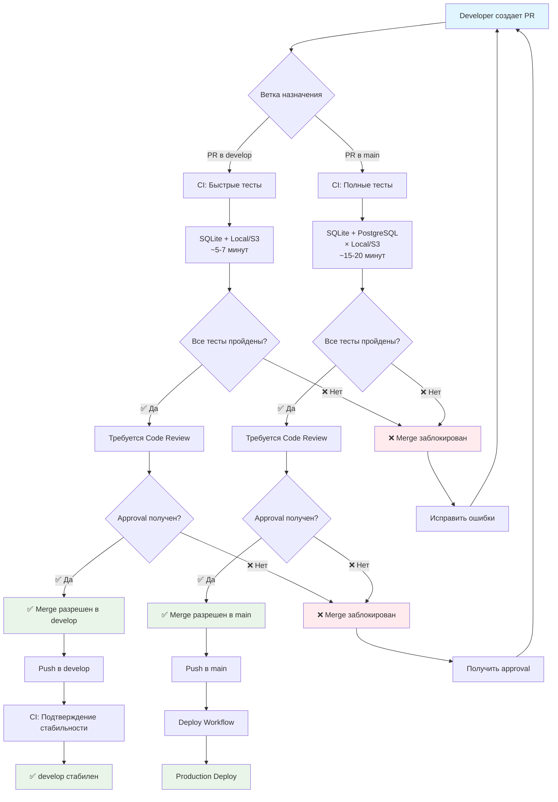

# 🛡️ Branch Protection Flow Diagram

## Схема работы защиты веток



## Статус-чеки для разных веток

### 🌿 develop ветка (быстрые тесты)

| Статус-чек                      | Описание                       | Время  |
| ------------------------------- | ------------------------------ | ------ |
| `lint-backend`                  | Линтинг backend кода           | ~1 мин |
| `lint-frontend`                 | Линтинг frontend кода          | ~1 мин |
| `test-backend (SQLite + Local)` | Тесты с SQLite + Local Storage | ~2 мин |
| `test-backend (SQLite + S3)`    | Тесты с SQLite + S3 Storage    | ~3 мин |
| `build-frontend`                | Сборка frontend                | ~2 мин |
| `docker-build-test`             | Тестовая сборка Docker         | ~3 мин |

**Итого:** ~12 минут

### 🏭 main ветка (полные тесты)

| Статус-чек                          | Описание                           | Время  |
| ----------------------------------- | ---------------------------------- | ------ |
| `lint-backend`                      | Линтинг backend кода               | ~1 мин |
| `lint-frontend`                     | Линтинг frontend кода              | ~1 мин |
| `test-backend (SQLite + Local)`     | Тесты с SQLite + Local Storage     | ~2 мин |
| `test-backend (SQLite + S3)`        | Тесты с SQLite + S3 Storage        | ~3 мин |
| `test-backend (PostgreSQL + Local)` | Тесты с PostgreSQL + Local Storage | ~5 мин |
| `test-backend (PostgreSQL + S3)`    | Тесты с PostgreSQL + S3 Storage    | ~6 мин |
| `build-frontend`                    | Сборка frontend                    | ~2 мин |
| `docker-build-test`                 | Тестовая сборка Docker             | ~3 мин |

**Итого:** ~23 минуты

## 🔒 Правила защиты

### Обязательные условия для merge

1. **Pull Request создан** - нельзя делать direct push
2. **Все статус-чеки пройдены** - тесты, линтеры, сборка
3. **Code Review получен** - минимум 1 approval
4. **Code Owner approval** - если настроен CODEOWNERS
5. **Ветка актуальна** - нет конфликтов с целевой веткой
6. **Все обсуждения закрыты** - нет открытых комментариев

### Запрещенные действия

- ❌ **Force push** - перезапись истории
- ❌ **Удаление веток** - случайная потеря кода
- ❌ **Direct push** - минуя PR процесс
- ❌ **Merge без approval** - обход code review

## 🚨 Emergency Bypass

### Для критических ситуаций

1. **Временное отключение защиты:**

   ```
   Settings → Branches → Edit rule → Disable
   ```

2. **Force push через GitHub CLI:**

   ```bash
   gh api repos/:owner/:repo/branches/main/protection \
     --method DELETE
   git push --force-with-lease origin main
   ```

3. **Hotfix workflow:**
   ```bash
   # Создать hotfix ветку
   git checkout -b hotfix/critical-bug
   # Исправить и закоммитить
   # Создать PR в main
   # Использовать skip_tests=true в deploy
   ```

## 🔧 Настройка защиты веток

### Вариант 1: Автоматическая настройка (GitBash)

```bash
# Откройте GitBash в корне проекта
# Убедитесь, что GitHub CLI установлен и авторизован
gh auth status

# Запустите автоматическую настройку
./scripts/setup-branch-protection.sh
```

### Вариант 2: Ручная настройка через GitHub UI

#### Пошаговая инструкция

1. **Перейти в Settings:**

   ```
   Repository → Settings → Branches
   ```

2. **Добавить правило для main:**

   ```
   Add rule → Branch name: main
   ```

3. **Настроить статус-чеки:**

   ```
   Require status checks to pass before merging
   ☑️ Require branches to be up to date before merging
   ```

4. **Добавить статус-чеки:**

   ```
   Status checks required:
   - lint-backend
   - lint-frontend
   - test-backend (SQLite + Local)
   - test-backend (SQLite + S3)
   - test-backend (PostgreSQL + Local)
   - test-backend (PostgreSQL + S3)
   - build-frontend
   - docker-build-test
   ```

5. **Настроить PR требования:**

   ```
   ☑️ Require a pull request before merging
   ☑️ Require approvals: 1
   ☑️ Dismiss stale reviews when new commits are pushed
   ☑️ Require review from code owners
   ```

6. **Дополнительные настройки:**
   ```
   ☑️ Require conversation resolution before merging
   ☑️ Include administrators
   ❌ Allow force pushes
   ❌ Allow deletions
   ```

## 🧪 Тестирование защиты

### Создание тестового PR

```bash
# Создать тестовую ветку
git checkout -b test/branch-protection

# Сделать изменения
echo "# Test" >> README.md
git add README.md
git commit -m "test: test branch protection"

# Push и создать PR
git push origin test/branch-protection
```

### Проверка блокировки

1. **Создать PR** в develop или main
2. **Проверить статус** - должен быть "blocked"
3. **Дождаться тестов** - статус изменится на "pending"
4. **Проверить merge button** - должен быть заблокирован
5. **После тестов** - merge должен стать доступным

---

**Поддержка:** DevOps Team  
**Последнее обновление:** 2025-10-04
