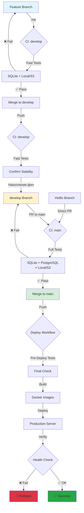

# 🚀 Deployment Flow Diagram

## Полная схема CI/CD процесса

## Временные затраты

| Этап                     | Время     | Описание                           |
| ------------------------ | --------- | ---------------------------------- |
| **Feature → develop**    | 5-7 мин   | Быстрые тесты (SQLite)             |
| **develop → main**       | 15-20 мин | Полные тесты (SQLite + PostgreSQL) |
| **Deploy to Production** | 10-15 мин | Build + Deploy + Verify            |
| **Общее время релиза**   | 30-42 мин | От merge в develop до production   |

## Критерии качества

### ✅ Merge в develop

- Линтер пройден
- Быстрые тесты пройдены
- Code review одобрен
- Нет конфликтов

### ✅ Merge в main

- Все полные тесты пройдены
- Lead/Senior review
- Changelog обновлен
- Версия обновлена

### ✅ Production Deploy

- Pre-deploy тесты пройдены
- Health checks успешны
- Мониторинг в норме

---

**Поддержка:** DevOps Team  
**Последнее обновление:** 2025-10-04
