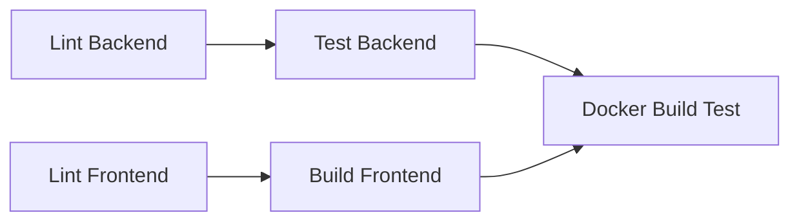
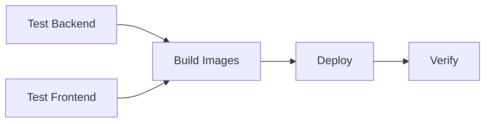

# 📋 GitHub Actions Workflows Guide

**Дата создания:** 2025-10-04  
**Версия:** 1.0

## 🎯 Обзор

Проект использует **2 основных workflow**:

1. **`ci.yml`** - Continuous Integration (тестирование и сборка)
2. **`deploy-prod.yml`** - Production Deployment (деплой на сервер)

---

## 🔄 Workflow 1: CI (Continuous Integration)

### 📍 Путь: `.github/workflows/ci.yml`

### 🚀 Триггеры

1. **Pull Request в develop (быстрые тесты):**
   - Из веток `feature/**`, `fix/**`
   - Тесты: SQLite + Local/S3 (~5-7 минут)

2. **Push в develop:**
   - После мерджа PR
   - Подтверждение стабильности develop ветки

3. **Pull Request в main (полные тесты):**
   - Из ветки `develop`
   - Тесты: SQLite + PostgreSQL × Local/S3 (~15-20 минут)
   - Обязательная проверка перед production

4. **Ручной запуск:**
   - Actions → CI → Run workflow
   - Параметр: `run_full_matrix` - полное матричное тестирование

### 📊 Stages



#### 1. **Lint Backend**

- Проверка кода backend на ошибки линтера
- Генерация Prisma Client
- Кеширование pnpm зависимостей

#### 2. **Lint Frontend**

- Проверка кода frontend на ошибки линтера
- Кеширование pnpm зависимостей

#### 3. **Test Backend (Matrix)**

**Быстрые тесты (PR в develop, push в develop):**

- ✅ SQLite + Local Storage (~2 мин)
- ✅ SQLite + S3 Storage (~3 мин)

**Полное тестирование (PR в main):**

- ✅ SQLite + Local Storage (~2 мин)
- ✅ SQLite + S3 Storage (~3 мин)
- ✅ PostgreSQL + Local Storage (~5 мин)
- ✅ PostgreSQL + S3 Storage (~6 мин)

**Что происходит:**

- Динамическая генерация `settings.test.matrix.yaml`
- Использование GitHub Secrets для S3 (если настроены)
- Автоматический запуск PostgreSQL для PostgreSQL тестов
- Запуск unit и e2e тестов
- Загрузка coverage в Codecov

#### 4. **Build Frontend**

- Сборка production версии
- Загрузка артефактов

#### 5. **Docker Build Test**

- Проверка сборки Docker образов:
  - Backend
  - Frontend
  - Gateway
- Использование GitHub Actions cache

### ⚡ Производительность

- **Быстрые тесты:** ~5-7 минут
- **Полное тестирование:** ~15-20 минут
- **Кеширование:** pnpm store, Docker layers

---

## 🚢 Workflow 2: Deploy to Production

### 📍 Путь: `.github/workflows/deploy-prod.yml`

### 🚀 Триггеры

1. **Автоматический запуск:**
   - Push в `main` ветку (после мерджа PR из develop)
   - Запускается только после успешного CI

2. **Ручной запуск (для экстренных случаев):**
   - Actions → Deploy to Production → Run workflow
   - Параметр: `skip_tests` - пропустить тесты (только для hotfix!)

### 📊 Stages



#### 1. **Test Backend & Frontend**

- Быстрые тесты (SQLite + Local/S3)
- Линтер для frontend
- Сборка frontend

#### 2. **Build Docker Images**

- Сборка всех Docker образов
- Использование GitHub Actions cache

#### 3. **Deploy to Production Server**

- Подключение к серверу по SSH
- Pull последних изменений
- Пересборка образов на сервере
- Перезапуск контейнеров
- Очистка старых образов

#### 4. **Verify Deployment**

- Проверка статуса контейнеров
- Health check backend API
- Rollback при ошибках

### 🔐 Необходимые Secrets

```
SSH_HOST          - IP адрес production сервера
SSH_PORT          - SSH порт (обычно 22)
SSH_PRIVATE_KEY   - Приватный SSH ключ
SSH_USERNAME      - Имя пользователя SSH
APP_PATH          - Путь к приложению на сервере
```

### 🛡️ Безопасность

- SSH ключ создается временно и удаляется после деплоя
- Используется `environment: production` для дополнительной защиты
- Automatic cleanup при ошибках

---

## 📝 Использование

### Сценарий 1: Разработка новой фичи

```bash
# 1. Создайте ветку
git checkout -b feature/9

# 2. Внесите изменения и закоммитьте
git add .
git commit -m "feat: add new feature"

# 3. Push в GitHub
git push origin feature/9

# 4. CI автоматически запустится
# - Быстрые тесты (SQLite + Local/S3)
# - ~5-7 минут
```

### Сценарий 2: Pull Request с полным тестированием

```bash
# 1. Создайте PR в develop или main

# 2. Если нужно полное тестирование:
# - Перейдите в Actions → CI
# - Run workflow
# - Branch: ваша ветка
# - run_full_matrix: true

# 3. Дождитесь завершения всех тестов
# - Все комбинации БД и storage
# - ~15-20 минут
```

### Сценарий 3: Production Deploy

```bash
# 1. Merge PR в main
git checkout main
git merge develop
git push origin main

# 2. Deploy автоматически запустится
# - Тесты → Сборка → Деплой → Проверка
# - ~10-15 минут

# 3. Проверьте статус в Actions
```

### Сценарий 4: Hotfix в Production

```bash
# 1. Создайте fix ветку от main
git checkout -b fix/critical-bug main

# 2. Исправьте баг и протестируйте локально
pnpm run test

# 3. Push и создайте PR в main
git push origin fix/critical-bug

# 4. После approve merge в main
# Deploy автоматически запустится
```

---

## 🎛️ Настройка Secrets

### 1. Перейдите в Settings репозитория

```
Repository → Settings → Secrets and variables → Actions
```

### 2. Добавьте необходимые секреты

**Для тестирования (опционально):**

```
TEST_S3_ENDPOINT
TEST_S3_BUCKET
TEST_S3_ACCESS_KEY
TEST_S3_SECRET_KEY
TEST_S3_REGION
```

**Для деплоя (обязательно):**

```
SSH_HOST
SSH_PORT
SSH_PRIVATE_KEY
SSH_USERNAME
APP_PATH
```

### 3. Проверьте настройки

Запустите workflow вручную для проверки.

---

## 🐛 Troubleshooting

### CI падает на тестах

1. **Проверьте логи:**
   - Actions → CI → Failed job → View logs

2. **Локальное воспроизведение:**

   ```bash
   NODE_ENV=test pnpm run test
   ```

3. **Проверьте конфигурацию:**
   - `backend/settings.test.yaml`
   - Переменные окружения

### Deploy не запускается

1. **Проверьте ветку:**
   - Deploy работает только из `main`

2. **Проверьте секреты:**
   - Все ли SSH секреты настроены?

3. **Проверьте права:**
   - У вас есть права на deploy?

### Docker Build падает

1. **Очистите кеш:**
   - Вручную запустите workflow
   - GitHub Actions cache может быть поврежден

2. **Проверьте Dockerfile:**
   - Локальная сборка: `docker build -f backend/docker/Dockerfile .`

### SSH Connection Failed

1. **Проверьте SSH ключ:**
   - Формат должен быть правильным (включая BEGIN/END строки)

2. **Проверьте доступность сервера:**

   ```bash
   ssh -p PORT USERNAME@HOST
   ```

3. **Проверьте firewall:**
   - GitHub Actions IP ranges должны быть разрешены

---

## 📊 Мониторинг

### GitHub Actions Dashboard

```
Repository → Actions
```

**Полезные фильры:**

- `event:push` - только автоматические запуски
- `event:pull_request` - только PR
- `event:workflow_dispatch` - только ручные запуски

### Codecov Integration

- Coverage отчеты автоматически загружаются
- Доступны в PR comments
- Dashboard: https://codecov.io/gh/YOUR-ORG/avatar-gen

---

## 🔗 Связанные документы

- [GitHub Secrets Configuration](GITHUB_SECRETS_CONFIGURATION.md)
- [Quick Start Testing](../testing/QUICK_START_TESTING.md)
- [DevOps Integration Guide](DEVOPS_INTEGRATION_GUIDE.md)

---

**Поддержка:** DevOps Team  
**Последнее обновление:** 2025-10-04
